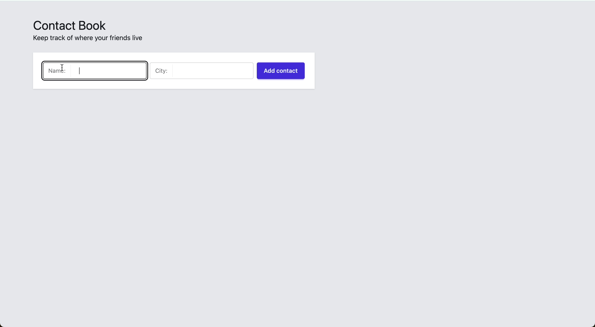

# Create a Contact Book app

> This repository is the companion to the ["Build a Contact Book app"](https://reactpractice.dev/exercise/create-a-simple-contact-book-app/?utm_source=github&utm_medium=social&utm_campaign=contact-book-app) practice exercise.

Build a simple Contact Book app that allows users to manage a collection of friends’ contact details.

For each Person, the user should be able to save the name and city where they live.
All contact details should be displayed on one page, as person “cards”.

Next to each person, show an "Edit" button; when clicked, only that Person becomes editable.
The "Edit" screen also allows users to "Delete" a person.

Build your solution using React with Typescript.
Use only the default React hooks (no need to add any libraries).

For the UI components, you can use Tailwind CSS and DaisyUI.

## Getting started:

- `npm install`
- `npm run dev`
